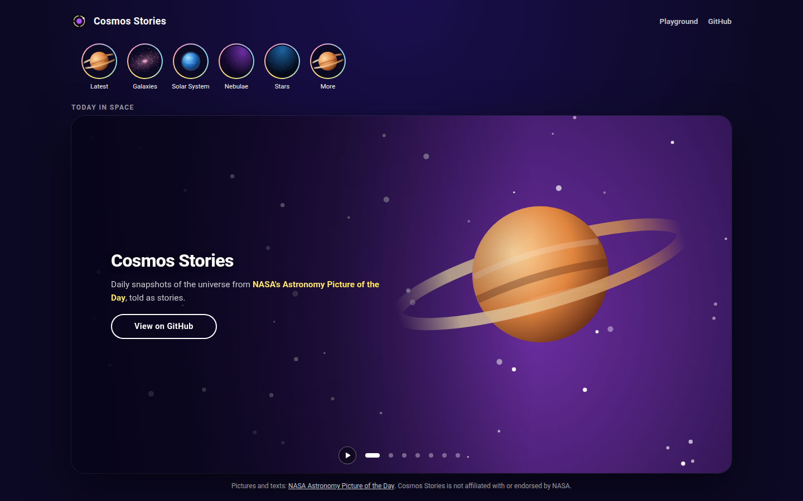
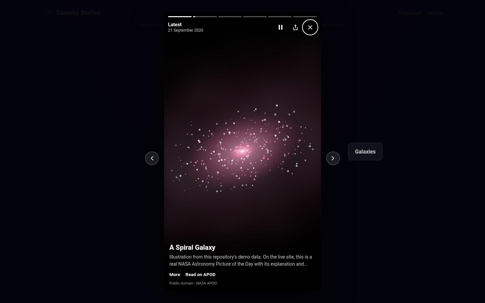
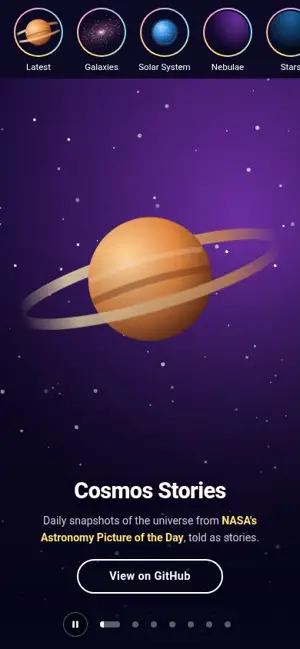
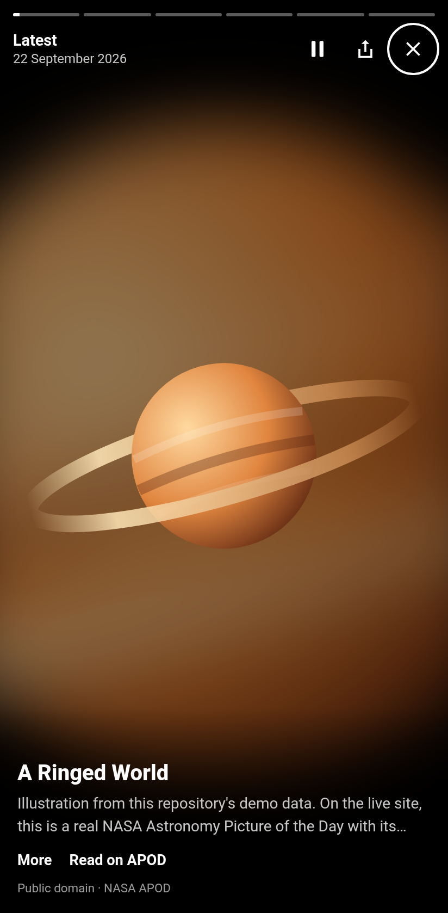
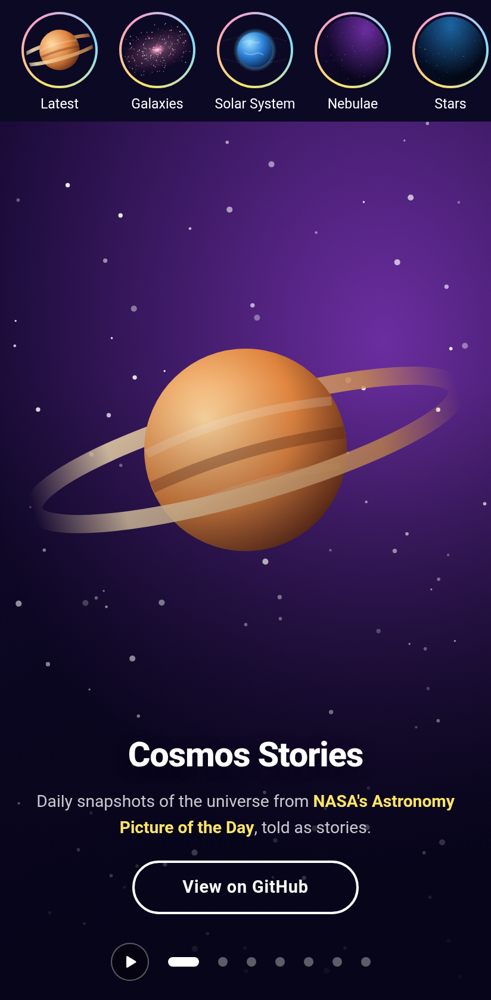

# Cosmos Stories

NASA's Astronomy Picture of the Day, told as stories, built with Angular 22.

Open a story ring and tap through the latest pictures: hold to look closer, swipe sideways to turn a 3D cube to the next topic, swipe down to close. Every story has its own address, so it can be shared, and the site installs as an app and keeps working offline. Underneath, one carousel engine without any framework code drives both the stories cube and the classic banner on the home page. It ships as its own Angular library, with a playground for every option.

**[Open the live demo](https://stiutin.github.io/cosmos-stories/)** · **[Carousel playground](https://stiutin.github.io/cosmos-stories/playground)**

<p align="center">
  
  
</p>
<p align="center">
  
  
  
</p>

## Features

- Stories with segmented progress bars; tap left or right to step, hold to pause, swipe down to close
- A 3D cube between story groups that follows the finger, with resistance at both ends
- Story rings that remember what has been seen, and resume at the first unseen story
- A shared view transition: the ring grows into the story and shrinks back into it
- A real address for every story, served as its own page, with sharing through the Web Share API
- Video stories that show a poster first and play in a privacy-enhanced embed on demand
- The "Today in space" banner: a seamless infinite carousel with a pausable autoplay
- A carousel playground: every option live, the engine state as it changes, and a template to copy
- Fresh pictures every night, optimised to AVIF and WebP when the site is built
- Installable as a Progressive Web App, works offline, and offers to update when a new build is ready
- Keyboard support, screen reader announcements, reduced motion respected, no axe violations
- Deployed to GitHub Pages from CI after every green push, and once a day

## Tech stack

[Angular 22](https://angular.dev/) (standalone, zoneless, signals, OnPush by default), a carousel library built with ng-packagr, RxJS, the Angular Service Worker, the View Transitions API, SCSS. Images are processed with [sharp](https://sharp.pixelplumbing.com/).
Tested with [Vitest](https://vitest.dev/), `node:test`, [Playwright](https://playwright.dev/), axe-core and Lighthouse CI.
Pictures and texts come from [NASA's Astronomy Picture of the Day](https://apod.nasa.gov/apod/).

## How it works

### The carousel engine

The carousel is a small library inside the repository, in `projects/carousel`, with two entry points. `@cosmos-stories/carousel/core` holds `CarouselEngine`, a state machine with no dependencies at all: it never touches the DOM, timers or animation frames. The host passes the time in through `tick(now)` and reports when a transition ends, so every behaviour is tested synchronously, down to the millisecond.

The infinite loop uses clones: the track renders a copy of the last slide before the first and a copy of the first after the last. Moving past an end animates onto a clone, so the motion keeps its direction, and when the transition ends the track jumps, without animation, to the real slide the clone shows. When a new move arrives while the track still rests on a clone, the engine makes the jump, marks the move as pending and waits for the renderer to paint before animating. That keeps the browser's timing an explicit part of the contract instead of a hidden race.

`@cosmos-stories/carousel` holds the Angular side: `<ui-carousel>` renders any template, maps pointer, keyboard, focus and visibility events to engine commands, and follows the WAI-ARIA carousel pattern.

### The stories player

The player is a lazy-loaded child route, `/stories/:group/:date`, that opens over the home page. The page underneath becomes inert and its banner pauses. The route parameters arrive as component inputs, and the player replaces the address as stories advance, so the back button leaves the player instead of stepping through stories.

Groups are faces of a cube driven by a second `CarouselEngine`, in bounded mode. Only the renderer differs: each face is rotated by 90° per step instead of translated. Stories inside a group run on the engine's `AutoplayClock` with named pause reasons (hold, hidden tab, picture still loading, open caption or video, the cube turning), so each concern only ever releases its own pause.

One directive tells a tap from a hold, a sideways drag and a swipe down. Gestures that start on a button or a link are left alone. The first navigation never runs a view transition, because its overlay would swallow the first taps on a freshly opened link.

### Data: a nightly snapshot

The APOD API needs a key, and calling it from the browser would put the key in the bundle and every visitor against the rate limit. Instead, a scheduled CI run fetches the latest pictures with the key from the repository secrets and writes a validated snapshot into the build. The site downloads one small file from its own origin.

The same validation module runs in Node, which executes the TypeScript directly, and again in the browser, so a damaged file loses a few entries rather than breaking the page. If the API is down, the build reuses the snapshot that is already live; if there is no real data at all, the run fails and the site keeps its previous deployment. Only public-domain pictures are kept by default, and each story shows its credit.

### Images, offline and updates

When the snapshot is built, every picture is converted to AVIF and WebP in four widths, from 160 to 1600 pixels, and served through `<picture>` with `srcset`. The next story is preloaded in the format the browser supports. The Service Worker keeps the app shell, the artwork and the pictures that have been seen; the snapshot is fetched fresh when the network answers within a few seconds, and from the cache otherwise.

### Performance and accessibility

Progress bars are painted straight from the animation frame loop instead of through signals, so autoplay costs no change detection per frame. A static shell in `index.html` paints before Angular starts, the first slide does not wait for data, and placeholders keep the layout still while it loads. Lighthouse on mobile scores 89–96 for performance and 100 for accessibility, best practices and SEO, with no layout shift. Inactive slides are inert, controls have visible focus and 24-pixel targets, and announcements are polite and only follow the user's own actions.

## Testing

| Layer       | Tool                 | What it covers                                                                               |
| ----------- | -------------------- | -------------------------------------------------------------------------------------------- |
| Unit        | Vitest, jsdom        | the engine, the library, the player, data validation, grouping, services - 192 tests         |
| Scripts     | `node:test`, sharp   | the image pipeline                                                                           |
| End-to-end  | Playwright, axe-core | rings, gestures, cube, keyboard, deep links, sharing, offline, the playground - 23 scenarios |
| Performance | Lighthouse CI        | performance, accessibility, best practices, SEO, layout shift                                |

Component tests use fake timers, which also fake animation frames, so the autoplay and the cube are tested frame by frame. The end-to-end tests run against a production build served like GitHub Pages, with fixture data, on a desktop and a phone viewport. Gestures are sent as pointer events, which is what the app itself handles.

## Project structure

```
src/app/
├── home/             home page: story rings, the banner; hosts the player route
├── stories/          player, cube, gestures, navigation, seen state, view transitions
├── playground/       interactive documentation for the carousel library
├── data/apod/        model, validation (shared with Node), grouping, image helpers, service
├── components/       banner carousel, slide, story rings, update prompt
└── services/         the banner's slides
projects/carousel/
├── core/src/         CarouselEngine, AutoplayClock, SwipeTracker, loop helpers
└── src/lib/          <ui-carousel>, the slide template directive, the swipe directive
scripts/              nightly snapshot, image optimisation, story pages, screenshots
e2e/                  Playwright tests, fixture data, a server that behaves like GitHub Pages
```

## Running locally

Requires Node 22.22.3 or newer (see `.nvmrc`).

```bash
git clone https://github.com/stiutin/cosmos-stories.git
cd cosmos-stories
npm ci
npm start
```

Without an API key, the site runs on sample data made from the repository's own artwork, and says so in the header. For real pictures, copy `.env.example` to `.env`, add a free key from [api.nasa.gov](https://api.nasa.gov), and run `npm run data:fetch`.

Other scripts:

```bash
npm run build          # production build
npm run build:lib      # the carousel library as a package, in dist/carousel
npm test               # unit tests for the app and the library
npm run test:scripts   # tests for the build scripts
npm run e2e            # build, then Playwright (run `npm run e2e:install` once)
npm run lighthouse     # Lighthouse CI
npm run screenshots    # regenerate the README screenshots
npm run lint           # ESLint and Stylelint
npm run typecheck      # TypeScript for the app, the specs, the scripts and the e2e suite
npm run check          # formatting, lint, types and unit tests, as in CI
```

Working on the project with an AI assistant? [`CLAUDE.md`](CLAUDE.md) has the full context.

## Deployment

Pushing to `master` runs formatting, lint, type checks, unit tests, the end-to-end suite and Lighthouse. Only when they pass does the deploy job fetch the newest pictures, build the site for `/cosmos-stories/`, write a page for every story and publish to GitHub Pages. The same deploy also runs every morning, so the stories follow the Astronomy Picture of the Day.

The deploy needs a `NASA_API_KEY` repository secret, and the `github-pages` environment must allow the `master` branch.

## Roadmap

- [ ] Prerendering with incremental hydration, for a stable Lighthouse 95+ on mobile
- [ ] A preview image for every shared story, built from its picture
- [ ] The APOD archive: a calendar, search, and "on this day" stories
- [ ] Favourites and personal collections, kept in IndexedDB
- [ ] Pinch to zoom into the full-resolution picture
- [ ] The YouTube player API, for video stories that last as long as the video
- [ ] Localisation, starting with German, Spanish, and Ukrainian
- [ ] Interface colours taken from each picture at build time
- [ ] Reading the explanation aloud with the Web Speech API
- [ ] Publishing the carousel library to npm, with a React adapter on the same engine
- [ ] Firefox and WebKit in the end-to-end suite, and visual regression tests
- [ ] A bridge to [threejs-solar-system](https://github.com/stiutin/threejs-solar-system) from the planet stories

## Credits

Pictures and texts come from [NASA's Astronomy Picture of the Day](https://apod.nasa.gov/apod/), with the credit of each picture shown on its story. Cosmos Stories is not affiliated with or endorsed by NASA. The artwork in `public/slides/` is original.

## License

Released under the [MIT License](LICENSE).

## Author

**Serge Tiutin** - [github.com/stiutin](https://github.com/stiutin)
