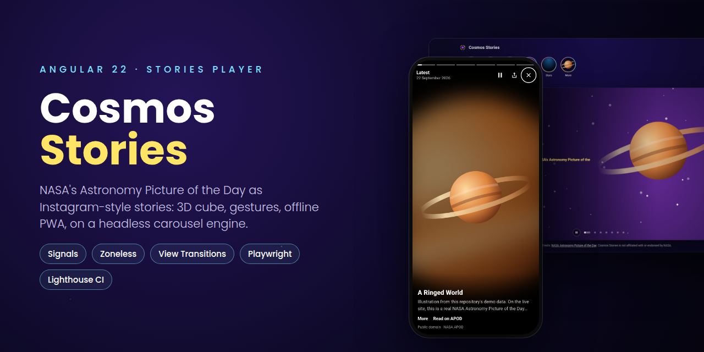
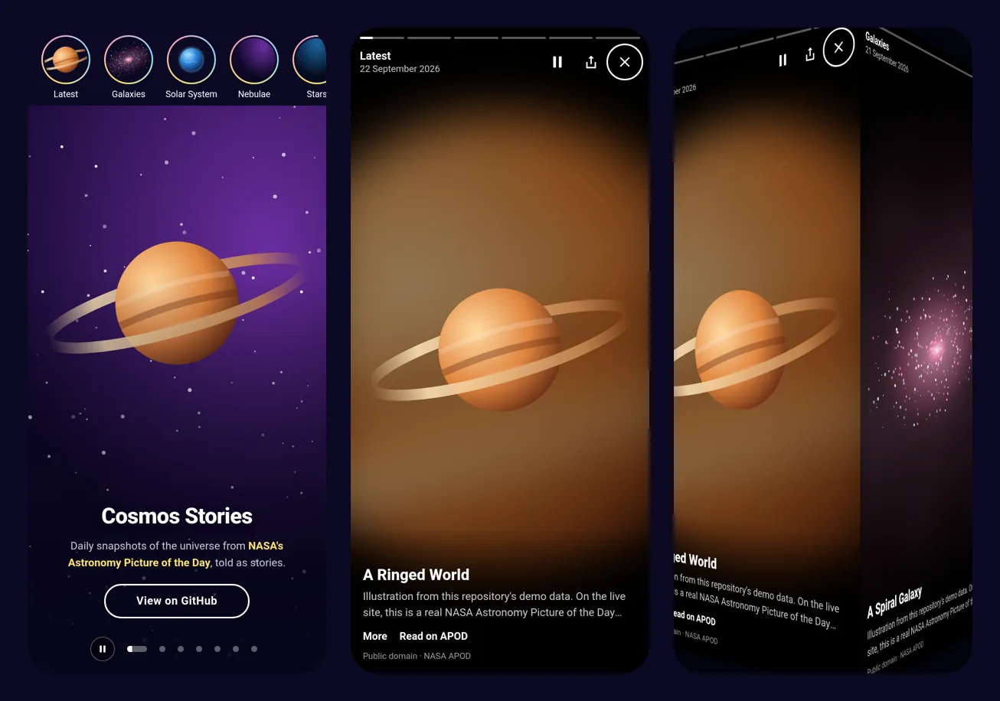
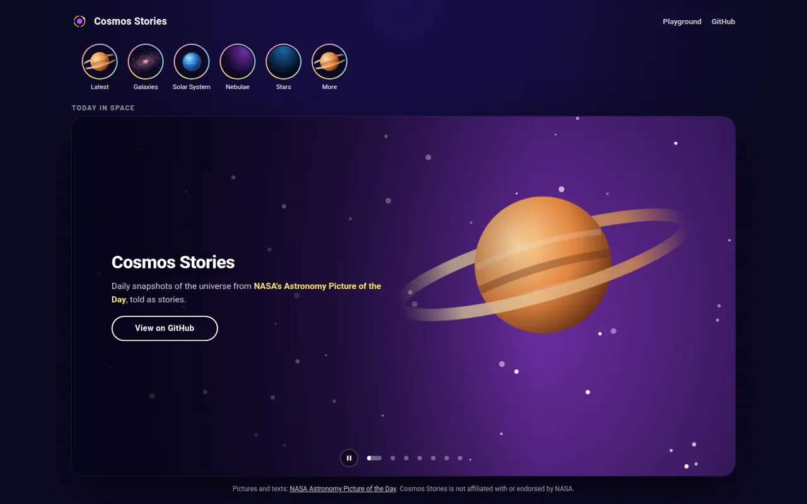
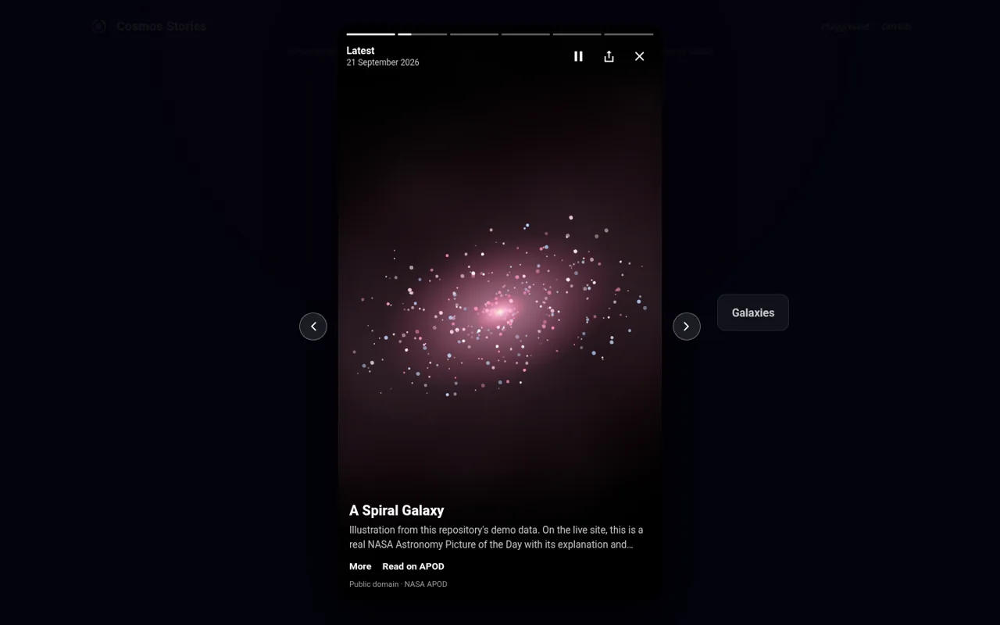
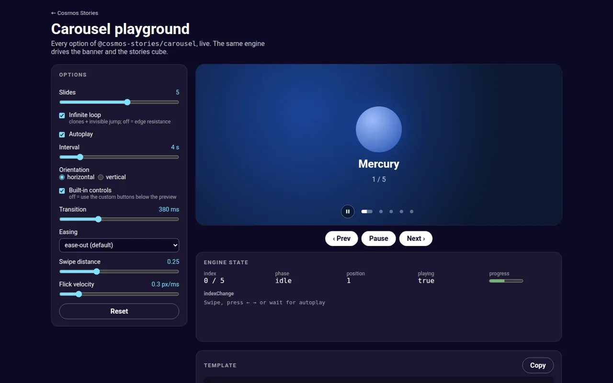
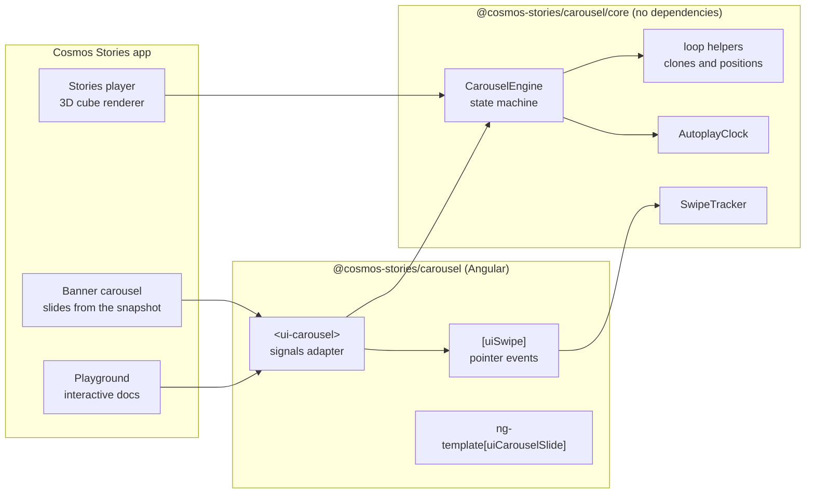
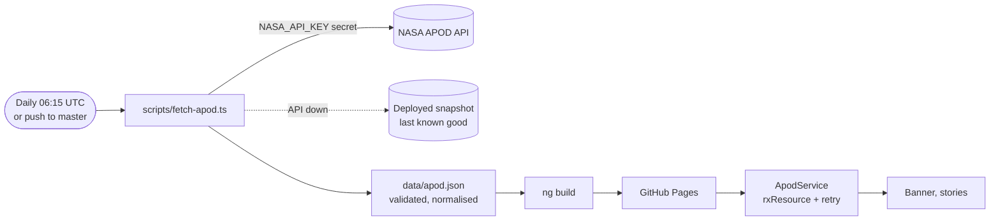

<p align="center">
  
</p>

<p align="center">
  <a href="https://stiutin.github.io/cosmos-stories/"><strong>▶ Live demo</strong></a>
  &nbsp;·&nbsp;
  <a href="https://stiutin.github.io/cosmos-stories/playground"><strong>Carousel playground</strong></a>
</p>

<p align="center">
  <a href="https://github.com/stiutin/cosmos-stories/actions/workflows/ci.yml"></a>
  
  
  
  
  <a href="LICENSE"></a>
</p>

# Cosmos Stories

**NASA's Astronomy Picture of the Day, told as Instagram-style stories.** Tap through today's picture, hold to look closer, swipe to turn a 3D cube to the next topic, and share any story by its URL. It works on phones and desktops, installs as an app, and keeps working offline.

Under the hood, one **framework-agnostic carousel engine** drives both the classic banner and the stories cube. It ships as its own Angular library, with a [playground](https://stiutin.github.io/cosmos-stories/playground) to try every option.

<p align="center">
  
  &nbsp;&nbsp;
  
</p>

> Screens above use the repository's own demo artwork. The live site shows real NASA pictures, refreshed every night.

## Features

### Stories player

- Segmented progress bars and 7-second stories. The timer waits until the picture is on screen.
- Tap left or right to step, **press and hold** to pause and hide the interface, **swipe down** to close.
- **Swipe sideways to turn a 3D cube** to the next group. It follows the finger and has edge resistance at both ends.
- Every story has a real URL, such as `/stories/galaxies/2026-09-21`, served with `200 OK` and shareable through the Web Share API or a copied link.
- Video stories show the poster first, then an allow-listed, privacy-enhanced embed (`youtube-nocookie.com`) on demand.
- On desktop: a 9:16 frame with neighbouring groups beside it, and ← → / Space / Esc shortcuts.
- The next picture is preloaded (typed AVIF preload), and the player is a lazy-loaded route.

### Home screen

- **Story rings:** groups with new stories come first with a gradient ring, and seen groups turn grey and move to the end. Seen state is kept in `localStorage`, and a ring resumes at the first unseen story.
- **View Transitions:** the ring morphs into the open story and back.
- **"Today in space" banner:** the latest pictures in a seamless infinite carousel, running on the same engine as the cube.

### Carousel library (`@cosmos-stories/carousel`)

- A headless `CarouselEngine`: a deterministic state machine with zero dependencies and 100 % line coverage.
- `<ui-carousel>`: content projection, signals API, `exportAs` for custom controls, horizontal or vertical, loop or bounded.
- Pointer gestures (touch, mouse, pen), flick velocity, and axis locking.
- The WAI-ARIA carousel pattern, a pause button (WCAG 2.2.2), `inert` off-screen slides, and reduced-motion support.
- **[Playground](https://stiutin.github.io/cosmos-stories/playground):** every input live, the engine state as it changes, and a generated template to copy.

### Platform

- **PWA:** installable, works offline (service worker), and prompts when a new daily build is ready.
- **Accessible:** 0 axe violations on every page and Lighthouse accessibility 100, both checked in CI.
- Responsive from 320 px phones to 4K, including landscape phones.

<p align="center">
  
  
</p>
<p align="center">
  
</p>                                         |

## Architecture



- **`CarouselEngine`** owns behaviour: navigation, the seamless loop, dragging, edge resistance and autoplay. It never touches the DOM or timers. The host passes time into `tick(now)` and reports `settle()`, so every behaviour is tested synchronously.
- **Renderers** are thin. `<ui-carousel>` translates a track; the stories player rotates cube faces by `90° × (index − position)`. The contract has five rules and is documented in the [library README](projects/carousel/README.md).
- **Animation without change detection.** Progress bars are painted from the frame loop, and Angular only re-renders when the state really changes.

```text
src/app/
├── home/              home page: rings, banner, header (child route host for the player)
├── stories/           player, cube, gestures, navigation, seen state, view transitions
├── playground/        interactive docs for the carousel library
├── data/apod/         model, validation (shared with Node), grouping, media helpers, service
├── components/        banner carousel, slide, story rings, update prompt
└── services/          banner composition
projects/carousel/
├── core/src/          CarouselEngine, AutoplayClock, SwipeTracker, loop helpers (no dependencies)
└── src/lib/           <ui-carousel>, [uiCarouselSlide], [uiSwipe]
scripts/               nightly snapshot, image optimisation, story pages, e2e preparation
e2e/                   Playwright tests, fixture data, GitHub-Pages-like static server
```

## Data pipeline



- **The API key never reaches the browser.** A scheduled GitHub Actions run (06:15 UTC, right after APOD publishes) uses the `NASA_API_KEY` secret and writes a validated snapshot into the build.
- **Validated twice by the same module:** `apod.parse.ts` has no runtime imports, so Node 24 runs it directly through type stripping when the snapshot is built, and the browser uses it again when the snapshot is loaded.
- **Resilient:** it retries 429 and 5xx responses, handles "today isn't published yet", falls back to the deployed snapshot, and on `master` never publishes sample data.
- **Rights-aware:** only public-domain media by default (`--include-copyrighted` to change that), with credits on every story.
- **Pictures are optimised once:** AVIF and WebP at 160, 480, 960 and 1600 px, self-hosted next to the snapshot.

## Performance and quality

Lighthouse on mobile (simulated throttling). The ranges cover several local runs of 3, and the runner's load moves scores by a few points:

| Page              | Performance | Accessibility | Best practices | SEO  | CLS    |
| ----------------- | ----------- | ------------- | -------------- | ---- | ------ |
| Home              | 89–95       | 100           | 100            | 100  | 0      |
| Deep-linked story | 88–96       | 100           | 100            | 100  | 0      |
| _Before stage 6_  | _67–77_     | _100_         | _100_          | _92_ | _0.12_ |

What moved the numbers: self-hosted AVIF/WebP instead of 0.2–2 MB JPEGs, a static shell and preloads, placeholders that keep the layout still, **no change detection per animation frame** (script time 2.5 s → 0.4 s under 4× CPU throttling), and real `200 OK` pages for story links. The medians hover around 90–95; what keeps them from a stable 95+ is Angular's own bootstrap (see [what's next](#whats-next)).

| Check                                                  | Tool                                                                                         | In CI                                                    |
| ------------------------------------------------------ | -------------------------------------------------------------------------------------------- | -------------------------------------------------------- |
| Unit tests (app, library, scripts)                     | Vitest, `node:test`                                                                          | on every push                                            |
| End-to-end, phone + desktop, including offline and axe | Playwright 1.63, axe-core                                                                    | required for deploy                                      |
| Accessibility, best practices, SEO, CLS, performance   | Lighthouse CI                                                                                | hard gates, with performance ≥ 85 and a warning below 95 |
| Types, lint, format                                    | TypeScript 6 strict, ESLint 10 (`typescript-eslint` strict, `angular-eslint` a11y), Prettier | on every push                                            |
| Bundle size                                            | Angular budgets                                                                              | warning at 350 kB, error at 400 kB                       |

## Getting started

Requires **Node.js 24** (or 22.22.3+), as Angular 22 does. See `.nvmrc`.

```bash
npm install
npm start                 # http://localhost:4200, with sample data
```

Real data locally: copy `.env.example` to `.env`, add a free key from [api.nasa.gov](https://api.nasa.gov), and run `npm run data:fetch`.

| Script                               | What it does                                                                   |
| ------------------------------------ | ------------------------------------------------------------------------------ |
| `npm start`                          | Dev server (installs the sample data if there is none)                         |
| `npm run build`                      | Production build of the app                                                    |
| `npm run build:lib`                  | Publishable carousel package in `dist/carousel`                                |
| `npm run data:fetch` / `data:sample` | Real snapshot from NASA / back to the sample                                   |
| `npm test`                           | Unit tests for the app and the library (Vitest)                                |
| `npm run test:scripts`               | Node tests for the data and image scripts                                      |
| `npm run test:coverage`              | Library tests with coverage                                                    |
| `npm run e2e`                        | **Builds, then** runs the Playwright tests (phone + desktop, axe, offline)     |
| `npm run e2e:run` / `e2e:ui`         | Re-run end-to-end tests without rebuilding / in UI mode                        |
| `npm run e2e:install`                | Downloads Playwright's Chromium (once per machine)                             |
| `npx lhci autorun`                   | Lighthouse with the project's gates (after `npm run e2e:build`)                |
| `npm run lint` / `format`            | ESLint / Prettier                                                              |
| `npm run check`                      | Format check, lint, script type checks and all unit tests (what CI runs first) |

Working on this repository with an AI assistant? [`CLAUDE.md`](CLAUDE.md) has the full context: architecture, invariants, conventions and pitfalls.

## Project structure

| Path                    | Purpose                                                                        |
| ----------------------- | ------------------------------------------------------------------------------ |
| `src/app`               | The Cosmos Stories application                                                 |
| `projects/carousel`     | The `@cosmos-stories/carousel` library (`core` has no dependencies)            |
| `scripts`               | Node 24 TypeScript scripts: snapshot, images, story pages, e2e preparation     |
| `e2e`                   | Playwright tests, fixture data, a static server that behaves like GitHub Pages |
| `data/apod.sample.json` | Sample data for development, based on the project's own artwork                |
| `public`                | Static assets: artwork, icons, manifest; `public/data` is generated            |
| `docs`                  | README images                                                                  |     |

## What's next

Ideas for future iterations, roughly by value:

1. **Prerendering / SSR with incremental hydration.** Render the home page and every story page at build time, closing the last gap to Lighthouse 95+ (Angular's bootstrap).
2. **Rich link previews per story.** The generated story pages get their own `og:title`, `og:description` and a 1200×630 `og:image` built from the cover, so a shared story shows its own picture in messengers.
3. **The APOD archive.** A calendar and search over 30 years of pictures, "on this day" stories, and infinite groups loaded on demand.
4. **Favourites and collections.** Double-tap to save, and personal story groups kept in IndexedDB.
5. **Zoom into the HD image.** Pinch and double-tap to zoom into `hdurl`, with the story paused.
6. **A native video experience.** The YouTube IFrame API for the real video length, a mute toggle, and a story timer that follows playback.
7. **Localisation.** A Ukrainian and English UI with Angular i18n and localised dates.
8. **Dynamic theming.** The dominant colour of each picture, extracted at build time, tints the interface of its story.
9. **Read-aloud.** The explanation read with the Web Speech API: accessibility, and a "podcast mode".
10. **Publish the carousel library to npm.** Versioning with Changesets, a docs site built from the playground, and support for more frameworks through the headless core (a React adapter would be a small layer).
11. **Wider test matrix.** Firefox and WebKit end-to-end runs, and visual regression screenshots.
12. **Real-user monitoring.** Core Web Vitals from the field (`web-vitals`), stored privately, to compare with Lighthouse lab numbers.
13. **A 3D bridge to the solar system.** Planet stories open an interactive Three.js scene (see [threejs-solar-system](https://github.com/stiutin/threejs-solar-system)).

## Credits and license

Pictures and texts come from [NASA's Astronomy Picture of the Day](https://apod.nasa.gov/apod/), with individual credits shown on each story. Cosmos Stories is not affiliated with or endorsed by NASA.

Code is [MIT](LICENSE). The artwork in `public/slides/` is original and ships under the same license.
